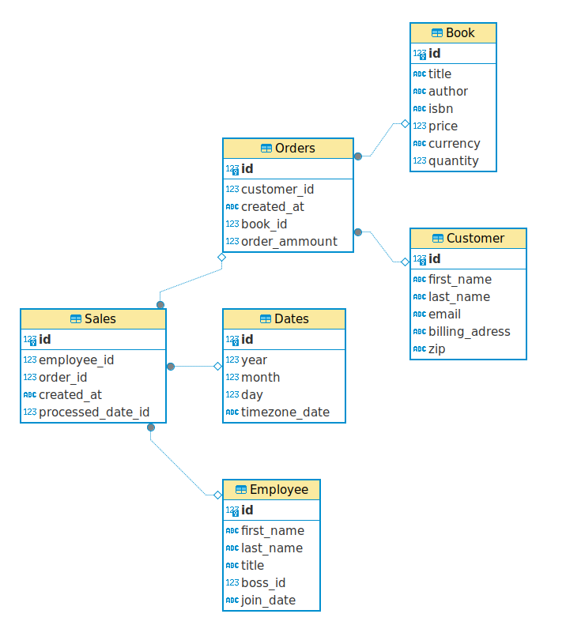
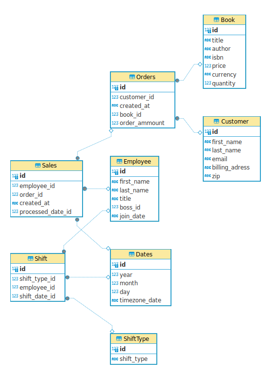

# Assignment 1: Design a Logical Model

## Question 1
Create a logical model for a small bookstore. 📚

At the minimum it should have employee, order, sales, customer, and book entities (tables). Determine sensible column and table design based on what you know about these concepts. Keep it simple, but work out sensible relationships to keep tables reasonably sized. Include a date table. There are several tools online you can use, I'd recommend [_Draw.io_](https://www.drawio.com/) or [_LucidChart_](https://www.lucidchart.com/pages/).

### Schema and queries   
   
CREATE TABLE IF NOT EXISTS Employee (   
    id INT PRIMARY KEY,   
    first_name VARCHAR(100),   
    last_name VARCHAR(100),   
    title VARCHAR(100),   
    boss_id INT,   
    join_date timestamp   
);   

CREATE TABLE IF NOT EXISTS Orders (   
   id INT PRIMARY KEY,   
   customer_id INT,   
   created_at timestamp,   
   book_id INT,   
   order_ammount INT,   
   FOREIGN KEY (customer_id) REFERENCES Customer(id),   
   FOREIGN KEY (book_id) REFERENCES Book(id)   
);   

CREATE TABLE IF NOT EXISTS Sales (   
    id INT PRIMARY KEY,   
    employee_id INT,   
    order_id INT,   
    created_at timestamp,   
    processed_date_id INT,   
    FOREIGN KEY (employee_id) REFERENCES Employee(id),   
    FOREIGN KEY (order_id) REFERENCES Orders(id),   
    FOREIGN KEY (processed_date_id) REFERENCES Dates(id)   
);   

CREATE TABLE IF NOT EXISTS Customer (   
    id INT PRIMARY KEY,   
    first_name VARCHAR(100),   
	last_name VARCHAR(100),   
    email VARCHAR(100),   
    billing_adress VARCHAR(200),   
    zip VARCHAR(6)   
);   

CREATE TABLE IF NOT EXISTS Book (   
    id INT PRIMARY KEY,   
    title VARCHAR(100),   
    author VARCHAR(100),   
    isbn VARCHAR(50),   
    price DECIMAL(12, 3),   
    currency VARCHAR(3),   
    quantity INT   
);   

CREATE TABLE IF NOT EXISTS Dates (   
   id INT PRIMARY KEY,   
   year INT,   
   month INT,   
   day INT,   
   timezone_date VARCHAR(3)   
);   

## Question 2

We want to create employee shifts, splitting up the day into morning and evening. Add this to the ERD.    
As sqlite doesn't support enums, shift types moved to another table.   
    
CREATE TABLE IF NOT EXISTS Shift (   
    id INT PRIMARY KEY,   
    shift_type_id id,   
    employee_id INT,   
    shift_date_id INT,   
    FOREIGN KEY (employee_id) REFERENCES Employee(id),   
    FOREIGN KEY (shift_date_id) REFERENCES Dates(id),   
    FOREIGN KEY (shift_type_id) REFERENCES ShiftType(id)   
);   

CREATE TABLE IF NOT EXISTS ShiftType (   
    id INT PRIMARY KEY,   
    // specify type here    
    shift_type VARCHAR(100)   
);   

## Question 3
The store wants to keep customer addresses. Propose two architectures for the CUSTOMER_ADDRESS table, one that will retain changes, and another that will overwrite. Which is type 1, which is type 2?   

Type 1   
CREATE TABLE IF NOT EXISTS CustomerAddress (   
        id INT PRIMARY KEY,   
	customer_id INT,   
	address VARCHAR(100),   
	unit VARCHAR(3),   
	zip VARCHAR(6),   
	region VARCHAR(100),   
	country VARCHAR(100),   
	FOREIGN KEY (customer_id) REFERENCES Customer(id)
);   

Type 2 - no history, overwrite, primary key is cusotmer id, records are not unique per Customer
CREATE TABLE IF NOT EXISTS CustomerAddress (   
        customer_id INT PRIMARY KEY,   
	address VARCHAR(100),   
	unit VARCHAR(3),   
	zip VARCHAR(6),   
	region VARCHAR(100),   
	country VARCHAR(100),   
	FOREIGN KEY (customer_id) REFERENCES Customer(id)
);   

Bonus: Are there privacy implications to this, why or why not?
```
Audit logs is best practise. So history here is must have. It will prevents i.e. Employee to send orders themself and revert address.   
```

## Question 4
Review the AdventureWorks Schema [here](https://i.stack.imgur.com/LMu4W.gif)

Highlight at least two differences between it and your ERD. Would you change anything in yours?
```
The AdventureWorks ERD is reach business domain schema. It displays entities for Production, Person, Sales, Purchasing. The ERD contains information bout the version, how to print it ansd other useful information.   
It is not clear from EDR the column types, besides that it show some specific db monitoring information for DBA.
My EDR displays column types, however it missing colors which can help to navigate over domains.  These are 2 difference. I would add colors schema to my EDR.
```

# Criteria

[Assignment Rubric](./assignment_rubric.md)

# Submission Information

🚨 **Please review our [Assignment Submission Guide](https://github.com/UofT-DSI/onboarding/blob/main/onboarding_documents/submissions.md)** 🚨 for detailed instructions on how to format, branch, and submit your work. Following these guidelines is crucial for your submissions to be evaluated correctly.

### Submission Parameters:
* Submission Due Date: `June 1, 2024`
* The branch name for your repo should be: `model-design`
* What to submit for this assignment:
    * This markdown (design_a_logical_model.md) should be populated.
    * Two Entity-Relationship Diagrams (preferably in a pdf, jpeg, png format).
* What the pull request link should look like for this assignment: `https://github.com/<your_github_username>/sql/pull/<pr_id>`
    * Open a private window in your browser. Copy and paste the link to your pull request into the address bar. Make sure you can see your pull request properly. This helps the technical facilitator and learning support staff review your submission easily.

Checklist:
- [ ] Create a branch called `model-design`.
- [ ] Ensure that the repository is public.
- [ ] Review [the PR description guidelines](https://github.com/UofT-DSI/onboarding/blob/main/onboarding_documents/submissions.md#guidelines-for-pull-request-descriptions) and adhere to them.
- [ ] Verify that the link is accessible in a private browser window.

If you encounter any difficulties or have questions, please don't hesitate to reach out to our team via our Slack at `#cohort-3-help`. Our Technical Facilitators and Learning Support staff are here to help you navigate any challenges.
